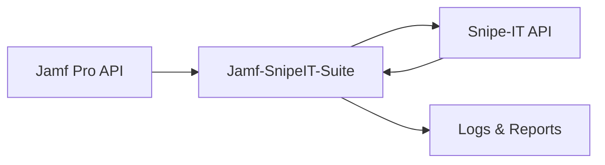

<div align="center">

# 🔗 Jamf SnipeIT Suite

> **Automated synchronization between Jamf Pro and Snipe-IT for seamless asset management**


[Features](#-features) • [Quick Start](#-quick-start) • [Configuration](#️-configuration) • [Contributing](#-contributing)

</div>

---

## 📑 Table of Contents

- [✨ Features](#-features)
- [📋 Prerequisites](#-prerequisites)
- [🚀 Quick Start](#-quick-start)
- [🐳 Docker Deployment](#-docker-deployment)
- [⚙️ Configuration](#️-configuration)
- [📖 Usage](#-usage)
- [🔧 Architecture](#-architecture)
- [🐛 Troubleshooting](#-troubleshooting)
- [🤝 Contributing](#-contributing)
- [📄 License](#-license)
- [👤 Author](#-author)

---

## ✨ Features

| Feature | Description |
|---------|-------------|
| 🔄 **Bi-directional Sync** | Synchronize assets between Jamf Pro and Snipe-IT |
| 📱 **Device Management** | Sync Macs, iPhones, iPads, and Apple TVs |
| 🏷️ **Custom Fields** | Map custom fields between platforms |
| 📊 **Status Tracking** | Keep asset status in sync |
| 🐳 **Docker Ready** | Easy deployment with Docker Compose |
| ⏰ **Scheduled Sync** | Automated synchronization via cron |
| 📝 **Detailed Logging** | Comprehensive logs for troubleshooting |
| 🔐 **Secure** | API tokens stored securely |

---

## 📋 Prerequisites

| Requirement | Version |
|-------------|---------|
| Python | 3.11+ |
| Docker | 20.10+ (optional) |
| Jamf Pro | API access |
| Snipe-IT | v6.0+ |

---

## 🚀 Quick Start

### Option 1: Docker (Recommended)

```bash
# Clone the repository
git clone https://github.com/CaputoDavide93/Jamf-SnipeIT-Suite.git
cd Jamf-SnipeIT-Suite

# Configure environment
cp config/config.example.yaml config/config.yaml
# Edit config/config.yaml with your settings

# Run with Docker Compose
docker-compose up -d
```

### Option 2: Local Installation

```bash
# Clone the repository
git clone https://github.com/CaputoDavide93/Jamf-SnipeIT-Suite.git
cd Jamf-SnipeIT-Suite

# Create virtual environment
python -m venv venv
source venv/bin/activate

# Install dependencies
pip install -r requirements.txt

# Configure
cp config/config.example.yaml config/config.yaml

# Run
python src/main.py
```

---

## 🐳 Docker Deployment

### Using Docker Compose

```yaml
version: '3.8'
services:
  jamf-snipeit-sync:
    build: .
    container_name: jamf-snipeit-sync
    volumes:
      - ./config:/app/config
      - ./logs:/app/logs
    environment:
      - TZ=UTC
    restart: unless-stopped
```

### Build and Run

```bash
# Build image
docker-compose build

# Start container
docker-compose up -d

# View logs
docker-compose logs -f
```

---

## ⚙️ Configuration

### Configuration File

Create `config/config.yaml`:

```yaml
jamf:
  url: "https://your-jamf.jamfcloud.com"
  username: "${JAMF_API_USER}"
  password: "${JAMF_API_PASSWORD}"

snipeit:
  url: "https://your-snipeit.example.com"
  api_key: "${SNIPEIT_API_KEY}"

sync:
  interval: 3600  # seconds
  devices:
    - computers
    - mobile_devices
  
logging:
  level: INFO
  file: logs/sync.log
```

### Environment Variables

| Variable | Description | Required |
|----------|-------------|----------|
| `JAMF_API_USER` | Jamf Pro API username | ✅ |
| `JAMF_API_PASSWORD` | Jamf Pro API password | ✅ |
| `SNIPEIT_API_KEY` | Snipe-IT API key | ✅ |
| `SYNC_INTERVAL` | Sync interval (seconds) | ❌ |
| `LOG_LEVEL` | Logging level | ❌ |

---

## 📖 Usage

### Manual Sync

```bash
python src/main.py --sync-now
```

### Dry Run

```bash
python src/main.py --dry-run
```

### Sync Specific Device Type

```bash
python src/main.py --device-type computers
```

---

## 🔧 Architecture



### Project Structure

```
Jamf-SnipeIT-Suite/
├── src/
│   ├── main.py           # Entry point
│   ├── jamf_client.py    # Jamf Pro API client
│   ├── snipeit_client.py # Snipe-IT API client
│   └── sync_engine.py    # Synchronization logic
├── config/
│   └── config.yaml       # Configuration file
├── docker-compose.yml    # Docker composition
├── Dockerfile            # Container definition
└── requirements.txt      # Python dependencies
```

---

## 🐛 Troubleshooting

### Common Issues

<details>
<summary>❌ API Authentication Failed</summary>

```bash
# Verify Jamf credentials
curl -u "$JAMF_API_USER:$JAMF_API_PASSWORD" \
  "https://your-jamf.jamfcloud.com/api/v1/auth/token"
```
</details>

<details>
<summary>❌ Snipe-IT Connection Error</summary>

```bash
# Verify Snipe-IT API key
curl -H "Authorization: Bearer $SNIPEIT_API_KEY" \
  "https://your-snipeit.example.com/api/v1/hardware"
```
</details>

<details>
<summary>❌ Docker Container Not Starting</summary>

```bash
# Check container logs
docker-compose logs jamf-snipeit-sync

# Verify config mount
docker-compose exec jamf-snipeit-sync cat /app/config/config.yaml
```
</details>

---

## 🤝 Contributing

Contributions are welcome! Please see [CONTRIBUTING.md](CONTRIBUTING.md) for guidelines.

1. Fork the repository
2. Create a feature branch (`git checkout -b feature/amazing-feature`)
3. Commit changes (`git commit -m 'Add amazing feature'`)
4. Push to branch (`git push origin feature/amazing-feature`)
5. Open a Pull Request

---

## 🔒 Security

Please see [SECURITY.md](SECURITY.md) for reporting vulnerabilities.

---

## 📄 License

This project is licensed under the MIT License - see the [LICENSE](LICENSE) file for details.

---

<div align="center">

## 👤 Author

**Davide Caputo**

[](https://github.com/CaputoDavide93)
[](mailto:CaputoDav@gmail.com)

---

⭐ **If this tool helped you, please give it a star!** ⭐

</div>
