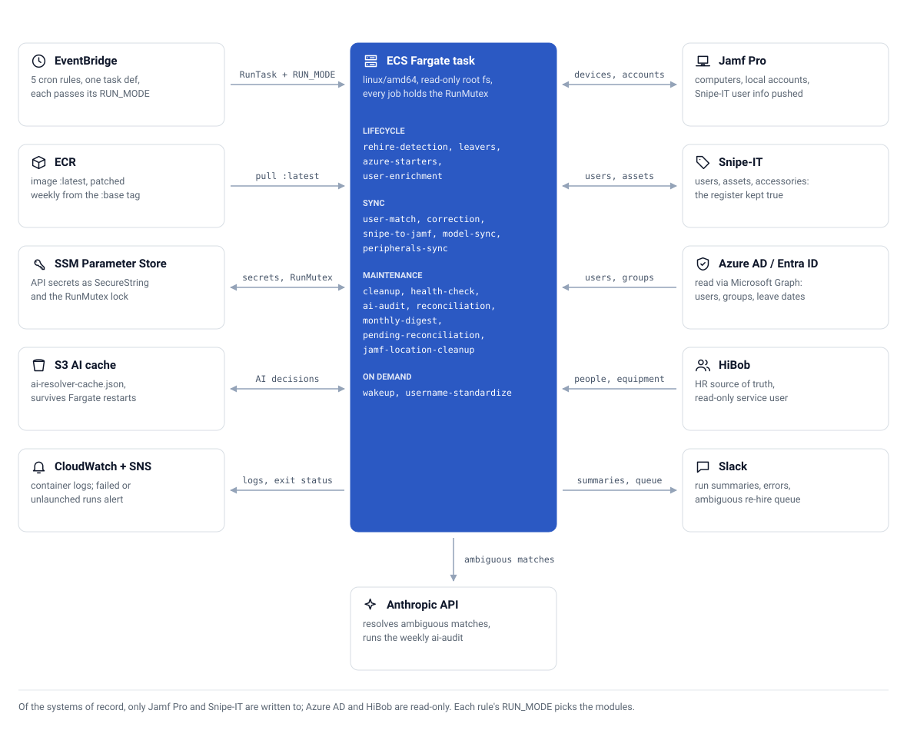
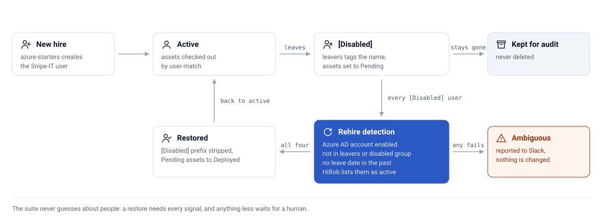

# 🔄 Jamf-SnipeIT Suite

**Unattended asset-lifecycle automation across Jamf Pro, Snipe-IT, Azure AD / Entra ID, and HiBob — serverless on AWS Fargate**


[](https://github.com/CaputoDavide93/Jamf-SnipeIT-Suite/actions/workflows/ci.yml)

---

## 📋 Table of Contents

- [Overview](#-overview)
- [Features](#-features)
- [Architecture](#-architecture)
- [Modules](#-modules)
  - [Lifecycle](#lifecycle)
  - [Sync](#sync)
  - [Maintenance](#maintenance)
- [The User Lifecycle Model](#-the-user-lifecycle-model)
- [Schedule](#-schedule)
- [Installation](#-installation)
- [Configuration](#-configuration)
- [Usage](#-usage)
- [Production Deployment (AWS)](#-production-deployment-aws)
- [Safety Model](#-safety-model)
- [Testing](#-testing)
- [Documentation](#-documentation)

---

## 🎯 Overview

Keeping an asset register truthful across four systems of record is a losing manual battle: people join, leave, change surname, convert from contract to permanent, and sometimes come back a day after being offboarded.
Each event touches Jamf (device management), Snipe-IT (asset register), Azure AD (identity), and HiBob (HR truth), and any drift between them means lost laptops, ghost users, and wrong audit answers.

This suite closes the loop automatically:

| System | Role |
|--------|------|
| 🖥️ **Jamf Pro** | Device management — serials, local accounts, hardware models |
| 📦 **Snipe-IT** | Asset register — ownership, checkout state, accessories |
| 🔑 **Azure AD / Entra ID** | Identity — account status, group membership, job titles |
| 👥 **HiBob** | **HR source of truth** — employment status, equipment entitlements *(read-only, never written to)* |

## ✨ Features

- 🤝 **Zero-touch user provisioning** — new starters (including contractors) appear in Snipe-IT before their first Monday
- 🔁 **Re-hire detection** — employees who leave and return (even next-day) are automatically un-ghosted and get their machine assignment restored
- 🧠 **Multi-strategy user matching** — exact / email / normalised-username / fuzzy scoring, with an AI resolver for genuinely ambiguous cases and manual overrides as the final word
- 🚪 **Leaver processing** — departed users' assets flip to *Pending*, accounts are tagged `[Disabled]`, nothing is deleted
- 🧾 **Accessory sync from HR** — HiBob equipment entitlements become Snipe-IT accessory checkouts
- 🛠️ **Self-healing** — a correction module continuously repairs wrong assignments; a health-check scans for stuck states twice a week
- 🔒 **Concurrency-safe** — every scheduled job serialises on a distributed mutex (SSM-backed); overlapping runs are skipped, never interleaved
- 🧪 **Dry-run everywhere** — every mutating module supports `--dry-run`; the newest modules default to it via a config safety latch
- 📣 **Slack reporting** — run summaries, error alerts, and human-decision queues (ambiguous re-hires) delivered to a channel
- 🚨 **Failure alerting** — any scheduled task that exits non-zero or never starts is pushed to an SNS topic (plus optional email); schedules that fail to launch raise a CloudWatch alarm
- 🧱 **Hardened container** — Debian trixie slim base patched at build time, non-root user, read-only root filesystem with ephemeral scratch mounts, weekly patch rebuilds from a `:base` tag

## 🏗 Architecture

<picture>
  <source media="(prefers-color-scheme: dark)" srcset="docs/assets/architecture-dark.svg">
  
</picture>

Every rule fires the same task definition; the `RUN_MODE` and command each rule passes decide which modules run, and every job holds the SSM-backed `RunMutex`. The task can run inside the Snipe-IT VPC so Snipe-IT is reached over its private IP.

## 🧩 Modules

### Lifecycle

| Module | Icon | What it does |
|--------|------|--------------|
| `azure-starters` | 🌱 | Creates Snipe-IT users for every member of the starters AAD group. Skips former employees (passed leave date) and aborts if the Snipe-IT fetch looks broken. Unique random password per user. |
| `user-enrichment` | 🏷️ | Enriches Snipe-IT users with AAD job titles and departments; persists an append-only **Contractor** marker so contractors are identifiable in the register. |
| `rehire-detection` | ♻️ | Reverses the leaver flow for returning employees — see [lifecycle model](#-the-user-lifecycle-model). Runs **before** every other lifecycle/sync module. |
| `leavers` | 🚪 | Tags departed users `[Disabled]`, flips their assets to *Pending*. Uses live AAD group membership + leave dates; per-asset re-verification before any change. |

### Sync

| Module | Icon | What it does |
|--------|------|--------------|
| `user-match` | 🧠 | Matches Jamf machines' local accounts to Snipe-IT users (override → exact → email → normalised → fuzzy → AI) and checks assets out to the right person. |
| `snipe-to-jamf` | 🔗 | Pushes the Snipe-IT asset ID back into a Jamf extension attribute for cross-linking. |
| `model-sync` | 💻 | Ensures every Jamf hardware model exists in Snipe-IT before assets need it. |
| `correction` | 🛠️ | Self-healing: detects and repairs wrong asset assignments using the machine's local account as ground truth. |
| `peripherals-sync` | 🎧 | Reads HiBob equipment entitlements (read-only) and mirrors them as Snipe-IT accessory checkouts. |

### Maintenance

| Module | Icon | What it does |
|--------|------|--------------|
| `cleanup` | 🧹 | De-duplicates user records and removes junk accounts. |
| `reconciliation` | ⚖️ | Full inventory diff across systems; reports drift. |
| `username-standardize` | ✂️ | Normalises usernames to `first.last` (email prefix), honouring configured exceptions. |
| `ai-audit` | 🔍 | Weekly AI-assisted cross-platform audit of suspicious assignments. |
| `health-check` | 🩺 | Scans for stuck states (assets pending too long, users disabled with assets, orphan checkouts) and alerts. |
| `wakeup` | ⏰ | Manual-only: sends wake commands to a Jamf smart group before big syncs. |

### One-off scripts

| Script | What it does |
|--------|--------------|
| `src/scripts/import_shipment_history.py` | One-off bulk import of a supplier shipment CSV into Snipe-IT accessories: normalises messy device descriptions to canonical accessory names (laptops are skipped — they arrive via `user-match`), matches recipients to Snipe-IT users (exact → known-correction → fuzzy), creates missing accessories, and checks them out in rate-limited batches. Dry-run by default; `--execute` to apply, `--analyze-only` to inspect the CSV offline. Run from `src/`: `python -m scripts.import_shipment_history <csv> --dry-run`. |

### CLI command inventory

<!-- AUTOGEN:modules -->
*22 CLI commands, generated from `src/main.py` by `tools/gen_modules_doc.py` — do not edit by hand.*

| Command | What it does | Scheduler default (cron) |
|---------|--------------|---------------------------|
| `leavers` | Mark assets of disabled Azure AD users as pending | `0 9 * * 1` |
| `rehire-detection` | Restore [Disabled] Snipe-IT users whose Azure AD account is active again | `35 18 * * 2` |
| `snipe-to-jamf` | Sync user information from Snipe-IT to Jamf Pro | `0 6 * * *` |
| `user-match` | Match Jamf computers to Snipe-IT users and provision assets | `0 9 * * 2` |
| `model-sync` | Sync hardware models between Jamf Pro and Snipe-IT | `0 2 * * 0` |
| `wakeup` | Send MDM redeploy commands to devices | — |
| `all` | Run all modules in sequence (except WakeUp) | — |
| `reconcile` | Reconcile inventory between Jamf Pro and Snipe-IT | — |
| `azure-starters` | Sync Azure AD starters group members to Snipe-IT users | `0 6 * * 1` |
| `correction` | Detect and fix wrong asset assignments from previous runs | `0 8 * * *` |
| `health-check` | Scan for stuck/inconsistent states and report to Slack | `0 9 * * *` |
| `pending-reconciliation` | Restore Pending assets whose owner is active again (Azure AD confirmed) | — |
| `jamf-location-cleanup` | Clear Jamf location/user for In-Stock and Retired machines | — |
| `ai-audit` | AI-powered cross-platform audit (security, compliance, anomalies) | `0 4 * * 0` |
| `cleanup` | Merge duplicate users and remove junk accounts | `0 3 * * 0` |
| `user-enrichment` | Push Azure AD fields (job title, dept) to Snipe-IT | `30 6 * * 1` |
| `peripherals-sync` | Sync HiBob equipment to Snipe-IT accessories | `0 8 * * 1` |
| `username-standardize` | Strip @domain from Snipe-IT usernames | — |
| `run-group` | Run a comma-separated list of modules sequentially under mutex | — |
| `health-server` | Start health check HTTP server | — |
| `reconciliation` | Reachable via `run-group` only | — |
| `monthly-digest` | Reachable via `run-group` only | — |
<!-- /AUTOGEN:modules -->

> The **Scheduler default** column is the built-in cron each job falls back to in the container scheduler (`src/docker_scheduler.py`) — `config.yaml` `jobs:` entries override it, and production timing is ultimately set by the EventBridge rules in `terraform/`.

## 🔄 The User Lifecycle Model

The suite models the full employee journey, including the awkward paths most tooling ignores:

<picture>
  <source media="(prefers-color-scheme: dark)" srcset="docs/assets/lifecycle-dark.svg">
  
</picture>

A `[Disabled]` user is **automatically restored** only when **four independent signals agree**:

1. ✅ Azure AD account is **enabled**
2. ✅ **Not** a member of the leavers or disabled AAD groups
3. ✅ No passed `employeeLeaveDateTime`
4. ✅ **HiBob lists them as an active employee** (HR source of truth, read-only)

Anything less (e.g. AAD enabled but still in the leavers group) is classified **ambiguous** and reported to Slack for a human decision — the suite never guesses on people.

## ⏰ Schedule

All jobs run in `Europe/London`, serialised under the run mutex. Local scheduler crons:

| Day | Time | Job | Purpose |
|-----|------|-----|---------|
| Mon | 17:00 | 🌱 `azure_starters` | Provision the week's new starters |
| Mon | 18:00 | 🏷️ `user_enrichment` | Titles, departments, contractor markers |
| Mon | 18:10 | 🎧 `peripherals_sync` | HiBob equipment → accessories |
| Mon+Thu | 19:00 | 🩺 `health_check` | Drift / stuck-state scan |
| Tue | 17:30 | ♻️ `rehire_detection` | Un-ghost returners **before** the sync chain |
| Tue | 18:00 | 🛠️ `correction` | Fix wrong assignments |
| Tue | 18:30 | 🧠 `user_match` | Match & check out machines |
| Tue | 19:00 | 🔗 `snipe_to_jamf` | Push asset IDs to Jamf |
| Tue | 19:30 | 🚪 `leavers` | Process departures **last** |
| Sun | 22:00–23:00 | 💻🧹✂️🔍⚖️ housekeeping | model_sync, cleanup, username_standardize, ai_audit, reconciliation |

> 🔐 **Why 30-minute slots?** A slow module can never overlap the next one — and even if it did, the per-job mutex skips (never interleaves) the collision.

## 📥 Installation

### Prerequisites

- Python **3.12+** (or Docker)
- API access to Jamf Pro, Snipe-IT, Azure AD (Graph), HiBob (read-only service user), Slack (bot token)

### Local

```bash
git clone <repo-url> && cd Jamf-SnipeIT-Suite
python3 -m venv venv && source venv/bin/activate
pip install -r requirements.txt
cp config/config.yaml.example config/config.yaml   # fill in credentials
python src/main.py                                  # interactive menu
```

### Docker

```bash
cp config/config.yaml.example config/config.yaml
docker compose up          # scheduler mode with health endpoint
```

## ⚙️ Configuration

Configuration is layered — **YAML for local runs, environment variables for containers** (env always wins):

| Source | Used by | Notes |
|--------|---------|-------|
| `config/config.yaml` | Local CLI & docker-compose | Gitignored — never committed |
| Task-definition env vars | AWS Fargate | Non-secret settings (group IDs, matching rules) |
| SSM Parameter Store | AWS Fargate | Secrets (`/jamf-snipeit-suite-prod/*`), read at container start |

Key settings:

| Setting | Purpose |
|---------|---------|
| `azure.starters_group_id` | AAD group of active staff to provision (active-users-only group) |
| `azure.leavers_group_id` / `disabled_group_id` | Leaver signals for lifecycle modules |
| `modules.<name>.enabled` | Skip a module across direct CLI, `run-group`, `all`, and scheduler execution |
| `modules.<name>.dry_run` | Force that module into dry-run; callers cannot force it back to live |
| `modules.rehire_detection.dry_run` | 🔒 Rehire safety latch — defaults to dry-run until explicitly disabled |
| `modules.rehire_detection.hibob_confirmation` | Require HiBob (read-only) to confirm re-hires |
| `modules.user_enrichment.mark_contractors` | Persist AAD `Contractor` department as a Snipe-IT marker |
| `modules.ai_audit.allow_external_pii` | Opt in to raw identifiers in external AI prompts; default payloads are tokenised |
| `modules.health_check.max_workers` | Bounded concurrency for the shared Jamf health index (default `8`) |
| `matching.skip_usernames` | Shared/test local accounts to ignore |
| `config/user_overrides.json` | 🚫 Local-only (gitignored, PII) — manual match overrides, baked into the image at build time |

Env-only deployments use `MODULE_<CANONICAL_NAME>_ENABLED` and
`MODULE_<CANONICAL_NAME>_DRY_RUN`, for example
`MODULE_USER_MATCH_DRY_RUN=true`. Terraform exposes the same controls through
`module_enabled_overrides` and `module_dry_run_overrides` maps.

## 🚀 Usage

```bash
# Interactive menu (all modules, guided)
python src/main.py

# Individual modules
python src/main.py rehire-detection --dry-run
python src/main.py leavers --dry-run
python src/main.py user-match
python src/main.py health-check

# Everything in dependency order
python src/main.py all

# Container: scheduler with NOW menu + /healthz liveness endpoint
RUN_MODE=scheduler python src/docker_scheduler.py --config config/config.yaml
```

Every mutating command accepts `--dry-run` / `-n` and prints exactly what it *would* change.

## ☁️ Production Deployment (AWS)

Production runs as **five EventBridge rules → one Fargate task definition** (`RUN_MODE` decides the module set). The task reads secrets from SSM at start; the image ships from ECR. Tasks can run inside the Snipe-IT VPC (`vpc_id` / `subnet_ids` in `terraform.tfvars`) so Snipe-IT is reached over its private IP even when its public endpoint is IP-restricted.

The one-shot path is `./scripts/deploy.sh`: Terraform plan/apply, then build and push `:latest` plus a `:base` tag (the weekly patch-rebuild job builds `FROM` it, and the ECR lifecycle policy protects both tags). The manual equivalent:

```bash
# 1. ECR login (12h token)
aws ecr get-login-password --region eu-west-1 \
  | docker login --username AWS --password-stdin <AWS_ACCOUNT_ID>.dkr.ecr.eu-west-1.amazonaws.com

# 2. Build — MUST be linux/amd64 (ARM64 silently fails on Fargate)
docker build --platform linux/amd64 \
  -t <AWS_ACCOUNT_ID>.dkr.ecr.eu-west-1.amazonaws.com/jamf-snipeit-suite-prod:latest .

# 3. Push — next EventBridge trigger picks it up automatically
docker push <AWS_ACCOUNT_ID>.dkr.ecr.eu-west-1.amazonaws.com/jamf-snipeit-suite-prod:latest
```

**Failure alerts:** set `alerts_topic_arn` (shared SNS topic) and/or `alarm_email` in `terraform.tfvars`. An EventBridge rule on *ECS Task State Change* forwards any task that stops with a non-zero exit code or `TaskFailedToStart`; a per-schedule `FailedInvocations` alarm catches RunTask launch failures, where no task ever exists.

> ⚠️ **Config changes ≠ code changes.** Fargate never reads `config.yaml` — non-secret settings live in the **task-definition environment**. To change one: register a new task-def revision, then repoint all five EventBridge rule targets to it. See [`docs/OPERATIONS.md`](docs/OPERATIONS.md).

## 🛡 Safety Model

| Guard | Protects against |
|-------|------------------|
| 🔒 Fail-closed distributed `RunMutex` (SSM) on **every** job | Overlapping or unlocked runs reverting each other's work |
| 🧪 Dry-run safety latch on new modules | A new module going live before its output is reviewed |
| 🕶️ Tokenised AI-audit payloads by default | Employee and device identifiers leaving the trust boundary |
| 🤝 4-signal re-hire confirmation incl. HiBob | Un-ghosting someone who is actually leaving |
| 🙋 Ambiguous-case human queue (Slack) | Automated guesses on people's employment state |
| 🧯 Fetch-integrity aborts | An empty API response triggering mass duplicate creation |
| ⏸️ *Pending*, never delete | Any destructive action on leaver data |
| 📴 HiBob strictly read-only | Any write ever reaching the HR source of truth |
| 🔒 Dry-run safety latch on Cleanup (added 2026-08-05) | Merging/deleting a user account on an email-collision false positive |
| 🧱 Read-only root filesystem (only `/tmp`, `/app/logs`, `/app/output` writable) | Code or dependencies being modified at runtime |
| 🚨 Task-failure + launch-failure alerts to SNS | A scheduled run failing silently |

## 📁 Repo Structure

```text
Jamf-SnipeIT-Suite/
├── src/
│   ├── clients/            # 🔌 Thin, retrying synchronous API clients (jamf, snipeit, azure, hibob, slack)
│   ├── core/               # ⚙️ Config schema, client factory, run context, sync state
│   ├── matching/           # 🧠 UserMatcher scoring engine + AI resolver
│   ├── infra/              # 🧱 RunMutex, health server, audit CSV, shared helpers
│   ├── modules/
│   │   ├── lifecycle/      # 🌱 azure_starters, user_enrichment, rehire_detection, leavers
│   │   ├── sync/           # 🔁 user_match, snipe_to_jamf, model_sync, correction, peripherals_sync
│   │   └── maintenance/    # 🧹 cleanup, reconciliation, username_standardize, ai_audit, health_check, monthly_digest
│   ├── scripts/            # 🧾 One-off imports (shipment history)
│   ├── main.py             # 🎛️ CLI entry point (interactive menu + subcommands)
│   └── docker_scheduler.py # ⏰ Container entry point (APScheduler + health endpoint)
├── config/                 # 📝 config.yaml.example + equipment mapping
├── terraform/              # ☁️ AWS infra (ECS, ECR, EventBridge, SSM, IAM, failure alerts)
├── tests/                  # 🧪 pytest suite
├── tools/                  # 🤖 gen_modules_doc.py (README inventory), gen_diagram.py (diagrams)
├── docs/                   # 📚 OPERATIONS.md runbook, assets/ diagram SVGs
└── scripts/                # 🚀 deploy.sh
```

---

## 🧪 Testing

```bash
pytest tests/ -v        # matcher scoring, lifecycle classification,
                        # rehire signals, starters guards, mutex & health helpers,
                        # azure-starters user creation (passwords, username convention)
                        # and the diagrams: committed SVGs == tools/gen_diagram.py output
```

CI ([`.github/workflows/ci.yml`](.github/workflows/ci.yml)) runs on every push/PR with SHA-pinned actions:

| Job | Checks |
|-----|--------|
| 🐍 `test` | `ruff check .` (baseline in [`ruff.toml`](ruff.toml)), `pytest` against the pinned lockfile, and a stale-inventory check (`python tools/gen_modules_doc.py --check`) |
| ☁️ `terraform` | `terraform fmt -check -recursive` and `terraform validate` (no backend) |

Local hooks via [pre-commit](https://pre-commit.com) (`pre-commit install`): **gitleaks** secret scan and **ruff**. Dependabot keeps pip, GitHub Actions, the Docker base image and Terraform providers current.

Dependencies are pinned for reproducible builds: `requirements.txt` is the human-edited abstract list, `requirements.lock.txt` is what the Docker build and CI actually install from. It holds **runtime dependencies only** (no pytest/ruff/dev tooling in the image). Regenerate it from a clean venv after changing `requirements.txt`:
```bash
python3 -m venv /tmp/lockenv && /tmp/lockenv/bin/pip install -r requirements.txt
/tmp/lockenv/bin/pip freeze > requirements.lock.txt   # review the diff before committing
```

## 📚 Documentation

- 🔧 **Runbook** (deploys, schedules, secret rotation, mutex) → [`docs/OPERATIONS.md`](docs/OPERATIONS.md)
- 🤝 **Contributing** → [`CONTRIBUTING.md`](CONTRIBUTING.md)

---

**If this tool helped you, please give it a star.** Made by [Davide Caputo](https://github.com/CaputoDavide93).
